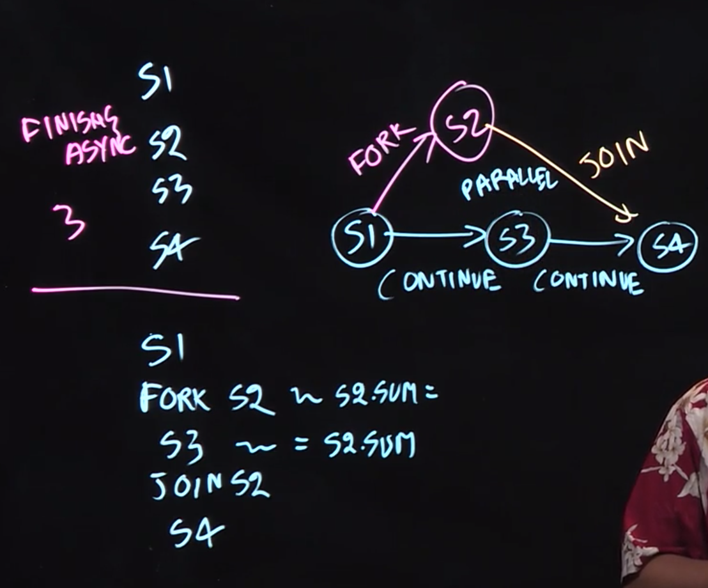

Some work should be done 

async: before what follows, after waht follows and parallel with what follows

`Finish`: make sure all the async tasks are completed, before you proceed.

We learned the *async* notation for task creation: “*async ⟨stmt1⟩*”, causes the parent task (*i.e.*, the task executing the async statement) to create a new child task to execute the body of the *async, ⟨stmt1⟩, asynchronously*(*i.e**.*, before, after, or in parallel) with the remainder of the parent task. 


## Java Fork-Join

```java
class Asum {
  int [] a;
  int lo;
  int hi;
  int sum;
  
  void compute(int [] a, int lo, int hi) {
    if (lo == hi) {
      sum = a[lo];
    }
    else if (lo > hi) sum = 0;
    else {
      mid = (lo + hi) / 2;
      l = new asum(A, lo, mid);
      r = new asum(A, mid+1, hi);
      l.fork(); // aync l.compute -> l.fork()
      r.compute;
      l.join();
      sum = l.sum + r.sum;
    }
  }
}
```

```java
async l.compute();
r.compute();
// in the java framework, we have another API
invokeall(l,r);
```



work: sum of the execution time of all the nodes

Span is the length of the longest path 

Ideal parallelism: 

```
work/span
```

this can be a metric for measuring parallelism.

## Parallelism

`T_p = Execution time in p processor`

