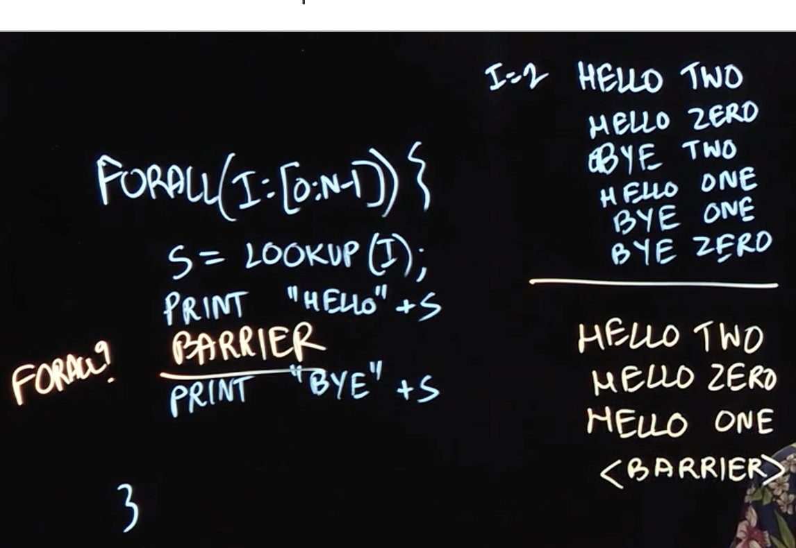

No iteration goes to the next phase, until all the iterations finish the current phase.

## Stencil Computation

$x_i = (x_{i-1} + x_{i+1}) / 2$, you can also have number of steps

with the notion of barrier operation, you can have less number of tasks created.